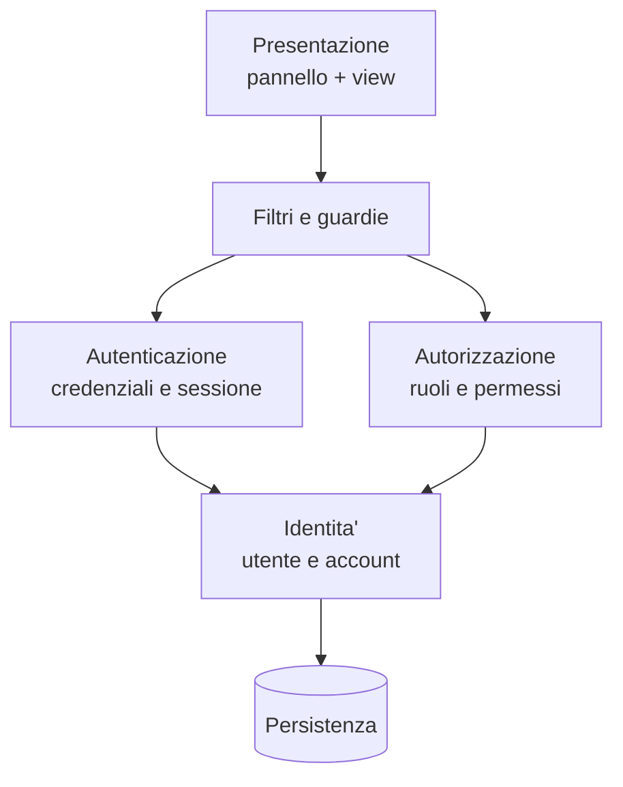
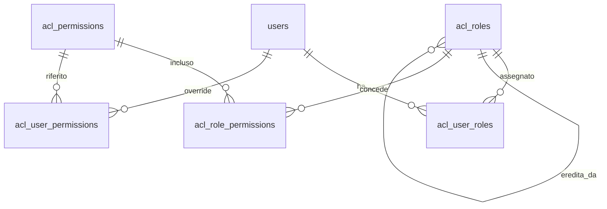
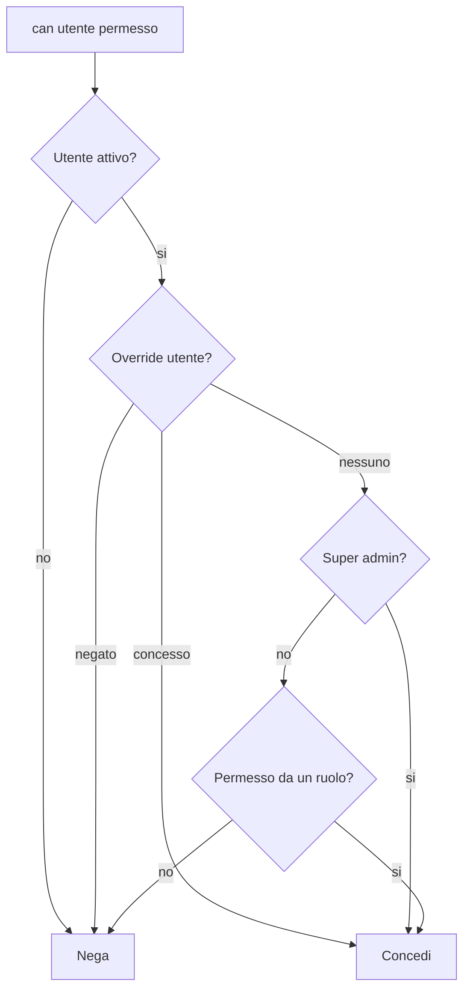
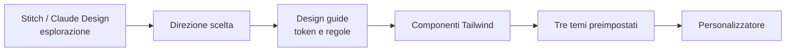
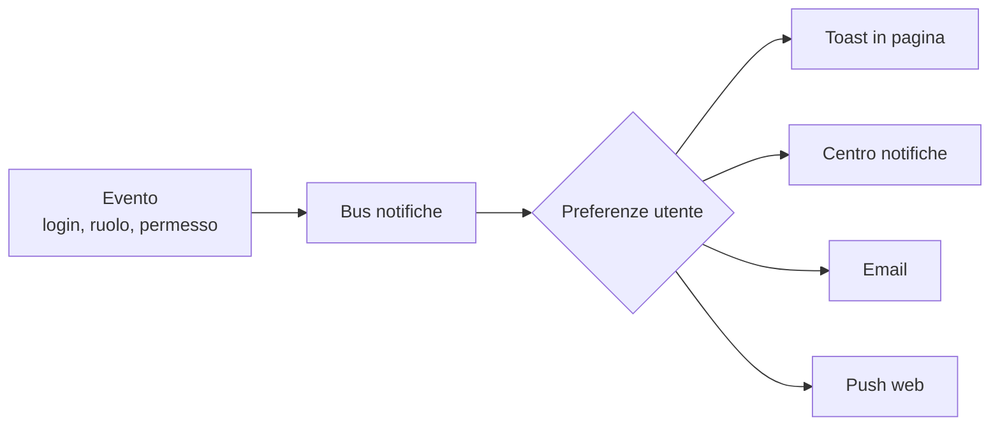
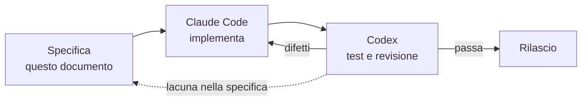

# RoleWarden - Specifiche e Roadmap

Aggiornato al 2026-09-20

## Nome commerciale

**RoleWarden.** Scelto il 20 settembre 2026 fra tre direzioni: lessico ACL esplicito, metafora del custode, coniato breve. Dice cosa governa il prodotto, si pronuncia, e regge anche se un domani lo strato di autorizzazione viene portato su Laravel, dove un nome costruito su `acl` resterebbe corretto ma piatto.

**Verifiche fatte prima di fissarlo.** Nessun item su CodeCanyon con quel termine, nessun pacchetto omonimo su Packagist, organizzazione GitHub libera, dominio `rolewarden.com` libero. Resta da fare una ricerca marchi formale su EUIPO in classe 9 e 42: la ricerca generale non ha fatto emergere nulla, ma eSearch plus non e' stato interrogato direttamente.

**Collisione nota, non bloccante.** `RoleWarden` esiste gia' come nome di classe dentro un pacchetto ACL per Laravel (`damianulan/laravel-sentinel`, namespace `Sentinel\Config\Warden\RoleWarden`). Non e' un marchio e non impedisce nulla, ma occupa qualche risultato nelle ricerche degli sviluppatori: da tenere presente quando si scrive la documentazione pubblica.

**Vincoli sul nome, validi per ogni materiale pubblico.** Il marchio non contiene ne' "Shield" ne' "CodeIgniter". Il primo creerebbe confusione con il pacchetto ufficiale del framework proprio sul terreno del supporto; il secondo e' un marchio del BCIT e va usato solo in senso descrittivo, cioe' nel sottotitolo dell'item e nella documentazione.

**Declinazioni da usare ovunque, senza varianti.**

| Dove | Forma |
| --- | --- |
| Dominio | `rolewarden.com` |
| Organizzazione GitHub | `rolewarden` |
| Repository | `codeigniter4-rolewarden` |
| Pacchetto Composer | `rolewarden/codeigniter4-rolewarden` |
| Namespace PHP | `RoleWarden\` |
| Prefisso tabelle | `acl_`, non legato al marchio e configurabile |
| Progetto PhpStorm | `rolewarden-ci4` |
| Titolo item CodeCanyon | `RoleWarden - Roles & Permissions Panel for CodeIgniter 4 (Shield)` |

**Da occupare subito.** Il vendor su Packagist si crea al primo submit ed e' first come first served, quindi dominio, organizzazione GitHub e vendor vanno registrati prima di iniziare l'MVP, non alla pubblicazione.

## Visione e posizionamento

Quello che si vende non e' l'autenticazione: e' il pannello di gestione di utenti, ruoli e permessi gia' pronto, piu' le ore di lavoro che l'acquirente non deve fare. CodeIgniter Shield copre gia' login, sessioni, token e gruppi, ed e' gratuito: il modulo ha senso solo se parte da dove Shield si ferma.

**Acquirente tipo.** Freelance o piccola agenzia che consegna gestionali su misura in CI4 e reimposta lo stesso strato utenti a ogni progetto. Compra per saltare due o tre settimane di lavoro, non per imparare un framework di autorizzazione.

**Dove ci differenziamo.**

| Area | Shield (gratuito) | RoleWarden |
| --- | --- | --- |
| Permessi | Gruppi e permessi definiti in un file di configurazione | Ruoli e permessi in database, gestiti da interfaccia a runtime |
| Interfaccia | Nessuna, solo libreria | Pannello admin completo su utenti, ruoli, permessi, sessioni |
| Override per utente | Assente | Concessione e revoca del singolo permesso sul singolo utente |
| Audit | Log eventi di base | Storico leggibile di chi ha cambiato cosa, con filtri |
| Onboarding | Documentazione per sviluppatori | Installer guidato, seed, app demo funzionante |

**Le tre promesse della pagina di vendita.** Installazione in meno di dieci minuti su un progetto CI4 esistente; nessuna modifica al codice del framework; ogni schermata del pannello sovrascrivibile senza toccare i file del modulo.

**Cosa non promettiamo.** Non e' un identity provider, non e' un SSO aziendale, non sostituisce Keycloak. Se l'acquirente ha bisogno di quello, non e' il nostro cliente.

## Architettura a strati

Quattro strati, ognuno sostituibile senza toccare gli altri. La regola che li tiene separati: l'autorizzazione non sa come l'utente si e' autenticato, e l'autenticazione non sa cosa l'utente puo' fare.

Una richiesta entra dai filtri: prima si stabilisce chi e' l'utente, poi se puo' fare quella cosa. Le due decisioni non si mescolano mai nello stesso metodo.

**Strato identita'.** Possiede l'utente e i suoi dati anagrafici. Non conosce password ne' sessioni. E' il punto in cui l'acquirente aggancia la propria tabella utenti esistente.

**Strato autenticazione.** Verifica una credenziale e apre una sessione. Ogni metodo di accesso e' un authenticator registrabile: password, token, in futuro OAuth e passkey. Aggiungere un metodo significa registrare una classe, non modificare il core.

**Strato autorizzazione.** Risponde a una sola domanda, `can(utente, permesso)`. Non fa query dirette dalle view.

**Strato presentazione.** View, layout e componenti del pannello. Non contiene logica di autorizzazione oltre al nascondere elementi in base a un permesso gia' risolto.

**Punti di estensione garantiti tra le versioni.** Sono il contratto con l'acquirente e non cambiano in modo incompatibile entro la stessa major.

1. Registrazione di authenticator personalizzati
2. Eventi su ogni passaggio di stato (login riuscito, login fallito, ruolo assegnato, permesso revocato, utente disattivato)
3. Override delle view per percorso, senza modificare i file del modulo
4. Sostituzione del modello utente con uno dell'applicazione ospite
5. Sostituzione del resolver dei permessi, per chi vuole una logica propria

**Regola di aggiornabilita'.** Tutto il modulo vive sotto un unico namespace e nessun file del pacchetto va editato dall'acquirente. Le personalizzazioni stanno nella sua applicazione. Cosi' un aggiornamento e' una sostituzione di cartella, non un merge manuale.

**Conseguenza della scelta di partire da zero su CI4.** Il codice parla direttamente al framework, senza astrazioni costruite per un secondo framework che oggi non esiste: modelli, filtri e query builder sono quelli di CI4. L'unica eccezione e' lo strato di autorizzazione, che resta in classi PHP senza dipendenze dal framework, con il framework che le raggiunge attraverso il filtro e l'helper. Non e' un core multi-framework, e' un confine tenuto pulito: se un giorno serve la versione Laravel, quelle classi si portano via invece di riscriverle.

## Rapporto con Shield

Il modulo estende Shield, non lo sostituisce. Shield resta padrone dell'identita' e dell'autenticazione, noi prendiamo l'autorizzazione e tutto cio' che si vede. E' una scelta che elimina circa un terzo dell'MVP, perche' login, hash delle password, remember-me, token e registro dei tentativi sono gia' scritti e gia' mantenuti da chi mantiene il framework.

**La divisione.**

| Ambito | Chi lo fa |
| --- | --- |
| Utenti, credenziali, identita' | Shield |
| Login, logout, sessione, remember-me | Shield |
| Token di accesso, HMAC, JWT | Shield |
| Registro dei tentativi e throttling | Shield |
| Verifica email e recupero password | Shield |
| Ruoli e permessi in database | Modulo |
| Gerarchia ruoli e override per utente | Modulo |
| Pannello admin e design system | Modulo |
| Notifiche | Modulo |
| Login social e collegamento account | Modulo, come authenticator Shield |
| TOTP e codici di recupero | Modulo, come action Shield |

**Il punto debole di Shield che risolviamo.** Shield tiene gruppi e permessi in un file di configurazione: aggiungere un ruolo significa modificare `app/Config/AuthGroups.php` e ridistribuire il codice. In database Shield mette solo le assegnazioni, in `auth_groups_users` e `auth_permissions_users` ([tabelle di Shield](https://codeigniter4.github.io/shield/customization/table_names/)). Chi consegna gestionali a clienti che vogliono creare ruoli da soli si ferma esattamente li'. Il modulo porta ruoli, permessi e gerarchia in database e li governa da interfaccia.

**Come ci agganciamo.** Tre punti, tutti previsti da Shield, nessuna modifica al suo codice.

1. **Entita' utente propria**, dichiarata nella configurazione di Shield, che estende la sua e sovrascrive `can()` indirizzandolo al nostro resolver. Il codice esistente dell'acquirente che gia' chiama `can()` continua a funzionare, con i permessi che ora arrivano dal database.
2. **Authenticator registrati** per il login social, accanto a session e token. Le identita' social finiscono in `auth_identities` con un tipo proprio, senza una tabella parallela.
3. **Action registrate** per i passaggi post-login, cioe' TOTP e verifiche aggiuntive, sullo stesso meccanismo che Shield usa gia' per il 2FA via email.

**Compatibilita' all'indietro.** I gruppi di Shield restano leggibili e vengono mappati sui nostri ruoli: `inGroup('admin')` continua a rispondere. Serve a chi ha gia' un progetto su Shield e vuole aggiungere il modulo senza riscrivere i controller. E' anche una riga forte nella pagina prodotto: funziona su quello che hai gia'.

**Cosa ci costa.** Seguiamo il ciclo di rilascio di Shield. Un loro cambiamento sull'entita' utente o sugli authenticator ci arriva addosso, quindi dichiariamo un intervallo di versioni supportate, lo verifichiamo in automatico a ogni rilascio e mettiamo in conto un aggiornamento nostro dopo ogni loro major. In cambio non manteniamo noi la parte dove un errore si paga piu' caro, cioe' la gestione delle credenziali.

**Il limite da dichiarare in vetrina.** Il modulo richiede Shield installato. Chi ha un'autenticazione propria e non vuole Shield non e' un nostro acquirente, e va scritto nella descrizione dell'item, non scoperto dopo l'acquisto.

**Versioni minime.** PHP 8.3 e CodeIgniter 4.7.4, collaudati fino a PHP 8.5 e all'ultima 4.x. Shield chiede molto meno, PHP 8.1 e CI 4.3.5 ([requisiti di Shield](https://github.com/codeigniter4/shield)), ma PHP 8.1 non riceve piu' patch dalla fine del 2025 e PHP 8.2 esce di supporto il 31 dicembre 2026 ([calendario PHP](https://www.php.net/supported-versions.php)). Dichiarare 8.2 significherebbe pubblicare un prodotto il cui minimo e' gia' scaduto pochi mesi dopo l'uscita, con la prima domanda di supporto che arriva da chi sta su un runtime senza patch. Da 8.3 il minimo resta in sicurezza fino a fine 2027, e su hosting condiviso 8.3 e' ormai ovunque. Su CI4 il salto da 4.3.5 a 4.7 costa poco all'acquirente, perche' gli aggiornamenti dentro il ramo 4 sono indolori, e ci evita di sostenere API che il framework ha gia' superato. Minimo alzato a CodeIgniter 4.7 il 2026-09-25: la cartella `app/Views/overrides/` su cui poggia la sovrascrittura delle view esiste solo da 4.7.0 (collaudo matrice di versioni, D1), e 4.5.8 porta 6 advisory di sicurezza note. Il 2026-09-26 il minimo e' salito a 4.7.4, che corregge le 5 advisory di sicurezza ancora presenti in 4.7.0.

## Modello dati

Le tabelle di Shield restano sue e non le tocchiamo. Il modulo ne aggiunge nove, con prefisso configurabile, tutte create da migrazioni CI4 reversibili e nessuna chiave esterna verso tabelle dell'applicazione ospite, tranne quella verso `users` che Shield gia' impone.

| Tabella | Contenuto | Di chi e' | Introdotta in |
| --- | --- | --- | --- |
| `users` | Anagrafica e stato dell'utente | Shield | - |
| `auth_identities` | Credenziali per tipo: password, token, reset, verifica, e le nostre identita' social | Shield | - |
| `auth_logins` | Tentativi di accesso, riusciti e falliti | Shield | - |
| `auth_remember_tokens` | Token remember-me | Shield | - |
| `auth_groups_users` | Gruppi Shield assegnati, letti per compatibilita' | Shield | - |
| `acl_roles` | Ruoli, con slug, descrizione, ruolo padre, flag di sistema | Modulo | MVP |
| `acl_permissions` | Permessi atomici, raggruppati per area | Modulo | MVP |
| `acl_role_permissions` | Permessi concessi a un ruolo | Modulo | MVP |
| `acl_user_roles` | Ruoli assegnati a un utente | Modulo | MVP |
| `acl_user_permissions` | Override per utente, con esito concesso o negato | Modulo | MVP |
| `acl_sessions` | Sessioni aperte per browser, con hash del token, IP, user agent, ultimo accesso e selettore del remember token collegato | Modulo | v1.0 |
| `acl_activity_log` | Chi ha cambiato cosa, su quale oggetto, quando | Modulo | v1.0 |
| `acl_notifications` | Notifiche per utente, con tipo, payload, stato letto | Modulo | v1.5 |
| `acl_notification_preferences` | Scelte per utente su tipo di evento e canale | Modulo | v1.5 |
| `acl_oauth_states` | Stati OAuth temporanei con scadenza, contro CSRF sul ritorno dal provider | Modulo | v1.5 |

**Scelte da fissare ora perche' costose da cambiare dopo.**

1. Prefisso `acl_` configurabile, scelto distinto da `auth_` di Shield perche' due sistemi di permessi convivono nello stesso database e i nomi non devono confondersi.
2. La chiave verso l'utente e' quella di Shield, cosi' la cancellazione di un utente si propaga come previsto da lui. Nessuna tabella utenti nostra, nessuna duplicazione.
3. Cancellazione logica su `acl_roles` con `deleted_at`: un ruolo rimosso non porta via lo storico delle assegnazioni.
4. I permessi si identificano per slug testuale, non per id, nelle chiamate del codice. Cosi' il codice dell'acquirente sopravvive a un reseed.
5. La colonna `is_system` su ruoli e permessi protegge i record che il modulo stesso usa: non sono cancellabili dall'interfaccia.
6. Una migrazione di importazione legge `app/Config/AuthGroups.php` e i gruppi gia' assegnati, e li trasforma in ruoli e permessi in database. E' il percorso d'ingresso per chi usa gia' Shield, e va scritto nella pagina prodotto.

## Modello dei permessi

Ruoli come contenitori, permessi atomici come unita' di verifica, override per utente come valvola di sfogo. Il codice dell'acquirente controlla sempre un permesso, mai un ruolo: `can('users.delete')`, mai `hasRole('admin')`. Questa e' la regola che rende il sistema modificabile dal pannello senza toccare il codice.

**Formato dei permessi.** `area.azione`, minuscolo, punto come separatore: `users.view`, `users.create`, `roles.assign`, `settings.update`. L'area raggruppa la schermata del pannello, l'azione e' il verbo. Il carattere jolly `users.*` e' ammesso solo nell'assegnazione, mai nella verifica.

**Ordine di risoluzione.** La prima regola che risponde vince e la valutazione si ferma.

Il diniego esplicito sull'utente batte qualsiasi ruolo, compreso il super admin. E' la regola che permette di sospendere un singolo privilegio a una persona senza smontarle i ruoli.

**Gerarchia dei ruoli.** Un ruolo puo' ereditare da un ruolo padre, un solo livello di profondita' per volta ma catena libera. L'ereditarieta' somma permessi e non li toglie mai: un figlio non puo' revocare cio' che il padre concede. I cicli sono impediti in fase di salvataggio.

**Super admin.** Un flag sul ruolo, non un permesso speciale. Chi lo possiede supera la verifica sui ruoli ma resta soggetto agli override negativi. Almeno un utente super admin attivo deve sempre esistere: l'interfaccia rifiuta l'operazione che lascerebbe il sistema senza.

**Cache.** I permessi effettivi di un utente si calcolano una volta e si tengono in cache con chiave per utente. Ogni scrittura su ruoli, permessi o assegnazioni invalida le chiavi toccate. Il driver e' quello configurato in CI4, senza dipendenze aggiuntive. Una modifica ai permessi ha effetto alla richiesta successiva, non serve il logout.

**Superficie pubblica dell'API.** Volutamente piccola, e' il contratto che non rompiamo entro la major.

| Chiamata | Risposta |
| --- | --- |
| `can($permesso)` | Booleano per l'utente in sessione |
| `canAny([$permessi])` | Vero se almeno uno e' concesso |
| `canAll([$permessi])` | Vero se tutti sono concessi |
| `authorize($permesso)` | Lancia un'eccezione se negato |
| `permissions()` | Elenco dei permessi effettivi, risolti |

La stessa logica e' esposta come filtro di rotta e come helper nelle view, ma dietro c'e' un solo resolver.

## Matrice funzionalita' per versione

Quattro tappe. L'MVP serve a validare l'architettura su un progetto reale, la v1.0 e' la prima versione pubblicabile su CodeCanyon, le successive sono aggiornamenti che giustificano il prezzo e alimentano le recensioni.

Le voci marcate Shield non sono da scrivere: il lavoro e' integrarle, vestirle con il design system ed esporle nel pannello. Restano in tabella perche' l'acquirente le trova nel prodotto finito e vanno collaudate a ogni rilascio.

| Funzionalita' | MVP | v1.0 | v1.5 | v2.0 |
| --- | --- | --- | --- | --- |
| Login, logout, sessione (Shield, viste nostre) | si |  |  |  |
| Registrazione e verifica email (Shield, viste nostre) | si |  |  |  |
| Recupero password (Shield, viste nostre) | si |  |  |  |
| Ruoli, permessi, assegnazioni | si |  |  |  |
| Override permesso per utente | si |  |  |  |
| Gerarchia ruoli | si |  |  |  |
| Filtro di rotta e helper nelle view | si |  |  |  |
| Pannello: utenti, ruoli, permessi | si |  |  |  |
| Migrazioni e seed | si |  |  |  |
| Ricordami (Shield, esposto nel pannello) |  | si |  |  |
| Throttling (Shield, configurabile da pannello) |  | si |  |  |
| Sessioni e remember token, con revoca |  | si |  |  |
| Log attivita' con filtri |  | si |  |  |
| Profilo utente e cambio password |  | si |  |  |
| Toast e riscontri nel pannello |  | si |  |  |
| Notifiche email sugli eventi di sicurezza |  | si |  |  |
| Importazione utenti da CSV |  | si |  |  |
| Installer guidato |  | si |  |  |
| App demo |  | si |  |  |
| Design guide con token documentati |  | si |  |  |
| Tre temi preimpostati, chiaro e scuro |  | si |  |  |
| Personalizzatore tema con anteprima |  | si |  |  |
| Documentazione completa |  | si |  |  |
| 2FA TOTP con codici di recupero |  |  | si |  |
| 2FA via email (action Shield) |  |  | si |  |
| Login social Google e Facebook |  |  | si |  |
| Provider OAuth aggiuntivi da configurazione |  |  | si |  |
| Collegamento e scollegamento account social |  |  | si |  |
| Centro notifiche con storico e contatore |  |  | si |  |
| Preferenze di notifica per utente |  |  | si |  |
| API token (Shield, gestiti dal pannello) |  |  | si |  |
| Inviti utente via email |  |  | si |  |
| Policy password configurabili |  |  | si |  |
| Impersonazione utente per supporto |  |  | si |  |
| Esportazione e importazione del tema |  |  | si |  |
| Tipografia personalizzata nel personalizzatore |  |  | si |  |
| Passkey WebAuthn |  |  |  | si |
| Notifiche push web |  |  |  | si |
| Canali di notifica esterni pronti (Slack, Telegram) |  |  |  | si |
| Permessi a livello di campo |  |  |  | si |
| Multi-tenant con scoping per organizzazione |  |  |  | si |
| Webhook sugli eventi di autenticazione |  |  |  | si |
| Esportazione dati utente per GDPR |  |  |  | si |

**Perche' questi tagli.**

Il 2FA resta fuori dalla v1.0 anche se e' la voce piu' vistosa in vetrina. Motivo: raddoppia la superficie di supporto (orologi disallineati, codici di recupero persi, utenti che si chiudono fuori) proprio nel periodo in cui le prime recensioni pesano di piu'. Entra in v1.5, quando il ciclo di supporto e' rodato.

Il multi-tenant resta in v2.0 perche' cambia la firma di ogni chiamata di autorizzazione. Farlo dopo e' una major, farlo prima ritarda l'uscita di mesi.

Log attivita' e gestione sessioni entrano gia' in v1.0: costano poco, si vedono in ogni screenshot della pagina prodotto e sono le prime cose che un compratore cerca in un pannello admin. Del sistema di notifiche entra in v1.0 solo lo strato minimo, toast ed email di sicurezza, perche' senza di quello il pannello sembra muto; il centro notifiche persistente aspetta la v1.5, insieme agli eventi che vale la pena archiviare. Il login social sta in v1.5 accanto al 2FA per lo stesso motivo: entrambi aggiungono percorsi di accesso alternativi e conviene stabilizzarli in un colpo solo.

## MVP in dettaglio

L'MVP non si vende. Serve a dimostrare che la stratificazione regge su un progetto vero prima di costruirci sopra sei mesi di lavoro. Si considera finito quando si installa su un'applicazione CI4 esistente senza toccarne il codice e il pannello governa interamente ruoli e permessi.

**Cosa entra.**

1. Installazione via Composer, un comando di setup, migrazioni e seed dei ruoli di sistema
2. Login con email e password, logout, sessione persistente
3. Registrazione con verifica email e recupero password
4. CRUD utenti con attivazione e disattivazione
5. CRUD ruoli, con gerarchia e flag di sistema
6. Assegnazione permessi al ruolo, con vista a matrice
7. Override del singolo permesso sul singolo utente
8. Filtro di rotta per permesso e helper `can()` nelle view
9. Pannello minimo ma completo su queste entita'

**Criteri di completamento.** Sono verifiche, non opinioni.

- [ ] Installazione su un progetto CI4 esistente, con tabella utenti gia' presente, senza modificare file del framework
- [ ] Un permesso revocato da pannello nega l'accesso alla richiesta successiva, senza logout
- [ ] Un override negativo batte il ruolo super admin
- [ ] Il sistema rifiuta l'operazione che elimina l'ultimo super admin attivo
- [ ] Un ciclo nella gerarchia ruoli viene rifiutato al salvataggio
- [ ] Rollback completo delle migrazioni senza residui in database
- [ ] Una view sovrascritta nell'applicazione ospite ha precedenza su quella del modulo

**Cosa resta fuori, dichiaratamente.** Nessun 2FA, nessun OAuth, nessun token API, nessun log attivita', nessun throttling, nessuna app demo, nessun installer grafico. Il pannello puo' essere brutto: la grafica si rifa' in v1.0, l'architettura no.

## Pannello admin

View CI4 server-side, Alpine.js per l'interattivita' locale. **Deciso il 2026-09-22:** nell'MVP lo stile e' CSS scritto a mano (CLAUDE.md vieta script di generazione, e una pipeline Tailwind lo sarebbe), un solo tema spartano, senza passaggio di build per nessuno. Tailwind e i componenti di riferimento su merakiui.com e tailblocks.cc restano il piano per la v1.0, quando arriva il design system vero descritto sotto.

**Schermate.**

| Schermata | Contenuto | Versione |
| --- | --- | --- |
| Login | Credenziali, recupero password | MVP |
| Elenco utenti | Tabella con ricerca, filtro per ruolo e stato, paginazione | MVP |
| Dettaglio utente | Anagrafica, ruoli assegnati, override permessi | MVP |
| Elenco ruoli | Ruoli con conteggio utenti e ruolo padre | MVP |
| Dettaglio ruolo | Matrice permessi per area, con selezione per riga | MVP |
| Elenco permessi | Permessi per area, sola lettura salvo i personalizzati | MVP |
| Profilo | Dati propri, cambio password | v1.0 |
| Sessioni | Dispositivi attivi con revoca singola o totale | v1.0 |
| Log attivita' | Eventi filtrabili per utente, azione e periodo | v1.0 |
| Impostazioni | Opzioni del modulo modificabili a runtime | v1.0 |
| Centro notifiche | Contatore, tendina con le ultime voci, storico filtrabile | v1.5 |
| Provider social | Stato dei provider, attivazione, ruolo predefinito, domini ammessi | v1.5 |
| Aspetto | Scelta del tema e personalizzatore con anteprima dal vivo | v1.0 |

**Matrice permessi.** E' la schermata che vende il prodotto e merita il tempo che costa. Righe le aree, colonne le azioni, caselle per intersezione, selezione per riga e per colonna, salvataggio parziale senza ricaricare la pagina. Le caselle ereditate dal ruolo padre appaiono selezionate ma bloccate, con l'origine indicata.

**Struttura delle view.** Un layout base, una cartella di partial e una di componenti. Ogni view e' risolta passando prima dall'applicazione ospite: se esiste un file con lo stesso percorso sotto la sua cartella di override, vince quello. L'acquirente ridisegna una schermata copiandola, non modificandola nel modulo.

**Temi.** Una sola foglia di variabili CSS controlla colori, tipografia, spaziatura, forma, elevazione e movimento. Cambiare stile e' un file, non una ricerca globale nelle classi. Tre temi preimpostati con variante chiara e scura, piu' il personalizzatore: dettagli nella sezione dedicata.

**Decisioni del 2026-09-23 sulle ambiguita' del collaudo v1.0.** (A1) Un login fallito mostra sempre lo stesso messaggio, che non rivela se l'email e' registrata. (A2) Un utente non puo' revocarsi da solo un ruolo senza il quale perderebbe `roles.assign`: l'"ultimo ruolo Administrator" del design system si definisce per permesso, non per nome. Se un override negato toglie gia' `roles.assign` all'utente, la revoca non e' raggiungibile affatto: la rotta stessa richiede quel permesso, ed e' il comportamento voluto (decisione del 2026-09-25, A2.DENY). (A3) Nella matrice di un ruolo, la revoca diretta di una casella ereditata dal padre si rifiuta con un messaggio che nomina il ruolo d'origine, invece di rispondere successo senza effetto. (A4) Nella ricerca utenti `%` e `_` si cercano come testo, non fanno da jolly.

**Decisioni del 2026-09-27 (V1).**
- **Riscontri.** I toast seguono il componente `Toast` del design system. Il tipo si capisce dalla parola iniziale ("Saved", "Warning:", "Error:"), non dal colore; solo l'errore usa `denied`. Esito e attenzione spariscono dopo 5 secondi, gli errori restano finché non si chiudono. Gli errori di validazione di un campo restano nel modulo, non vanno nei toast.
- **Impostazioni.** Le impostazioni del modulo si salvano con la libreria Settings di CodeIgniter, già usata da Shield: nessuna tabella nuova. Servono i permessi `settings.view` e `settings.update`, concessi ad `admin`; una migrazione di dati li porta anche sulle installazioni esistenti.
- **Ruolo predefinito.** In V1 l'unica impostazione è il ruolo predefinito per i nuovi utenti, assegnato sia a chi si registra tramite Shield sia a chi viene creato dal pannello. Un ruolo super admin non può essere il predefinito. Un ruolo con poteri amministrativi, come `admin`, resta scegliibile: la responsabilità è di chi lo imposta.
- **Voci fuori da V1.** Le altre voci della schermata Settings del design system arrivano con le loro tappe: sessione, ricordami e blocco in V2; conservazione del log in V3; password e 2FA in v1.5. Ruoli multipli per utente, profondità dell'ereditarietà e reset ai valori di serie non sono previsti.

**Decisioni del 2026-09-27 (V2).**
- **Sessioni.** Shield non tiene un elenco delle sessioni di un utente, e CI4 ruota l'id di sessione: il modulo aggiunge la tabella `acl_sessions` (id, user_id verso `users` in cascata, token_hash univoco, remember_selector, ip_address, user_agent, created_at, last_seen_at). Al primo accesso di una sessione vi si salva un token casuale e la riga col suo hash; un aggancio `pre_system` controlla la riga a ogni richiesta, e se manca chiude la sessione. La revoca vale quindi dalla richiesta successiva.
- **Remember token.** Restano quelli di Shield in `auth_remember_tokens`. La riga di sessione ricorda il selettore del token del proprio browser: revocare la sessione cancella anche quel token, revocare il token chiude anche le sessioni che ha aperto. La revoca totale cancella tutte le sessioni e tutti i token dell'utente, tranne la sessione di chi la chiede.
- **Durata della sessione.** Inattività massima modificabile dalle Impostazioni (30 minuti, 2 ore, 8 ore, 24 ore; predefinita 2 ore), applicata con `last_seen_at`. Scaduta per inattività, la sessione si chiude ma il remember token resta: il browser ricordato rientra da solo.
- **Ricordami.** Si salva nella `Auth.sessionConfig` di Shield tramite la libreria Settings (spento, 7, 30, 90 giorni). Shield la legge già con `setting()`: nulla di Shield è riscritto.
- **Throttling.** Shield offre solo il filtro `auth-rates`, fisso a 10 richieste al minuto per IP. Il modulo aggiunge il filtro `rw-signin` sulla rotta di login: un limite per IP configurabile (servizio `throttler` di CI4) e un blocco per email dopo N fallimenti dall'ultimo accesso riuscito, per una durata configurabile, contati da `auth_logins` di Shield. Il blocco vale per l'email digitata, registrata o no, così non rivela quali email esistono. Nessuna tabella nuova.
- **Profilo e permessi.** Profilo e sessioni proprie sono raggiungibili da ogni utente autenticato, senza permessi. Vedere e revocare le sessioni altrui richiede `sessions.view` e `sessions.revoke`, concessi ad `admin` con una migrazione di dati. Cambiare la password richiede quella attuale e chiude tutte le altre sessioni dell'utente.

**Decisioni del 2026-09-28 (V3).**
- **Tabella.** `acl_activity_log`: id, actor_id verso `users` con ON DELETE SET NULL, actor_label (nome dell'autore all'epoca, così lo storico sopravvive alla cancellazione), action (`area.evento`, es. `role.updated`), subject_type, subject_id, subject_label, details (JSON con i valori prima e dopo), ip_address, created_at. Indici su created_at, actor_id, action e (subject_type, subject_id).
- **Accessi.** I login riusciti e falliti restano nel registro di Shield, `auth_logins`, e non si copiano: la schermata del log unisce le due tabelle in una lista sola, filtrabile allo stesso modo. Nel log del modulo va solo ciò che Shield non registra: modifiche a utenti, ruoli, permessi e impostazioni, uscite, revoche di sessione.
- **Conservazione.** Dalle Impostazioni: 90 giorni, 1 anno (predefinito) o per sempre. La pulizia gira alla prima scrittura del giorno, senza cron, e tocca solo `acl_activity_log`: `auth_logins` resta di Shield.
- **Permesso ed estensione.** La schermata richiede `activity.view`, concesso ad `admin`. Ogni voce scritta emette l'evento CI4 `rolewarden.activity`, il punto d'aggancio per l'applicazione ospite.

**Decisioni del 2026-09-28 (V4).**
- **Nuovo accesso.** Dopo un login riuscito parte l'email se l'IP oppure il dispositivo (browser e sistema, dallo user agent) non compaiono in nessun accesso riuscito precedente dello stesso utente in `auth_logins`. Al primissimo accesso non parte nulla: non c'è niente con cui confrontare.
- **Password cambiata.** L'email va all'utente quando cambia la propria password dal profilo e quando gliela imposta un amministratore.
- **Troppi tentativi.** Quando un'email raggiunge la soglia di blocco, parte un avviso all'utente, se l'email è registrata, e a chi ha il permesso `security.alerts`, concesso ad `admin` con una migrazione di dati. Un avviso per blocco, non uno per tentativo.
- **Invio.** Le email si accodano durante la richiesta e partono dopo l'invio della risposta (funzione di shutdown, preceduta da `fastcgi_finish_request()` quando esiste; `post_system` di CodeIgniter scatta prima della risposta e la rallenterebbe), con il servizio Email di CodeIgniter e la `Config\Email` dell'ospite. Prima di ogni invio parte l'evento `rolewarden.mail`: se un listener restituisce `false`, l'invio diretto non avviene, così un'applicazione con una coda propria prende il messaggio. I template sono view sovrascrivibili come quelle del pannello.
- **Collaudo.** I messaggi si catturano con Mailpit, servizio del docker-compose di sviluppo, mai con un invio reale.

**Decisioni del 2026-09-30 e del 2026-10-03 (V5).**
- **Tailwind.** Chiusa la decisione aperta: il CSS del pannello si compila con la CLI standalone di Tailwind v4, senza Node né npm, da un sorgente scritto a mano. Il CSS compilato si committa nel modulo: chi installa non esegue build. Le classi componente `rw-*` restano, definite nel sorgente Tailwind sui token, così le view sovrascritte dagli acquirenti non si rompono.
- **File di tema.** Il personalizzatore salva il tema (tema di partenza e valori dei token semantici) in `writable/rolewarden/theme.json`, l'unica cartella che il web server può scrivere, fuori dal modulo, così un aggiornamento non lo tocca. Il modulo lo serve come CSS dalla sua rotta degli asset. Il personalizzatore permette anche di scaricarlo, per metterlo sotto versione; se l'applicazione ha un file di tema nella propria cartella `app/`, quello ha la precedenza.
- **Chiaro e scuro.** La variante la sceglie ogni utente dalla barra in alto (sistema, chiaro, scuro), salvata con la libreria Settings nel contesto dell'utente; senza scelta segue `prefers-color-scheme`. Il tema (Console, Clarity, Contrast) è globale.
- **Permesso.** Il personalizzatore richiede `appearance.update`, concesso ad `admin` con una migrazione di dati.
- **Tipografia.** La famiglia tipografica non si personalizza in v1.0 (il brief rimanda la tipografia personalizzata alla v1.5): i temi cambiano pesi e scala, non la famiglia.
- **Disegno dei temi.** I valori dei tre temi si approvano su un'anteprima applicata alle schermate reali prima di scrivere il codice.

**Elementi condizionati dai permessi.** Un pulsante che l'utente non puo' usare non viene reso, non viene disabilitato. Il controllo lato server resta comunque, perche' nascondere non e' proteggere.

## Design system

Serve un design system, non un tema. La differenza e' precisa: un tema cambia i colori, un design system garantisce che dopo averli cambiati il pannello resti coerente in ogni schermata, compresi i componenti che l'acquirente aggiungera' dopo di noi. E' anche argomento di vendita, perche' su CodeCanyon la prima immagine decide se la descrizione viene letta.

**Da dove nasce.** Le direzioni visive si generano con Google Stitch o con Claude Design, che producono in fretta schermate credibili e varianti da confrontare. Quello che esce non entra nel pacchetto cosi' com'e': serve a scegliere. Una volta scelta la direzione, la si riduce a token e componenti, e da li' in poi la fonte di verita' e' la design guide, non il file generato. Il rischio da evitare e' spedire markup generato, incoerente da schermata a schermata e impossibile da mantenere.

**Tre livelli di token, e la regola che rende impossibile romperli.** La coerenza non si ottiene con la disciplina di chi scrive il codice, ma togliendo la possibilita' di sbagliare.

1. **Primitivi.** La materia grezza: la scala completa dei colori, le dimensioni, i pesi tipografici. Nessun componente li usa mai direttamente.
2. **Semantici.** Il ruolo, non il valore: superficie, superficie sollevata, testo primario, testo attenuato, bordo, accento, pericolo, anello di focus. Ogni componente usa soltanto questi.
3. **Di componente.** Solo dove un componente ha bisogno di una deroga, e comunque derivata da un token semantico, mai da un primitivo.

Da qui discendono tre divieti che valgono per noi e per chi estende il pannello: nessun valore grezzo nel markup, nessun colore arbitrario in una classe utility, nessuna spaziatura fuori scala. Se un componente non trova il token semantico che gli serve, manca un token: si aggiunge alla scala, non si inventa un'eccezione.

**Cosa tocca il personalizzatore.** Solo il livello semantico. L'acquirente rimappa i ruoli sui primitivi, non riscrive i componenti. E' questo il motivo per cui una personalizzazione spinta non produce mai un pannello sconnesso: qualunque valore scelga, tutti i componenti leggono lo stesso ruolo.

**Token.** Un solo livello di variabili CSS governa tutto. Un tema e' un insieme di valori per questi gruppi, nient'altro.

| Gruppo | Controlla |
| --- | --- |
| Colore | Primario, superfici, bordi, testo, stati di esito ed errore |
| Tipografia | Famiglia, scala dimensionale, peso, interlinea |
| Spaziatura | Unita' base e densita' delle tabelle |
| Forma | Raggio degli angoli, spessore dei bordi |
| Elevazione | Ombre e livelli di sovrapposizione |
| Movimento | Durate e curve delle transizioni |

**Inventario dei componenti.** Ogni componente esiste una volta sola, con le sue varianti e i suoi stati gia' definiti. Un componente non documentato qui non entra nel pannello.

| Componente | Varianti | Stati |
| --- | --- | --- |
| Bottone | Primario, secondario, fantasma, distruttivo | Normale, hover, focus, premuto, disabilitato, in attesa |
| Campo | Testo, area, select, checkbox, radio, interruttore | Normale, focus, errore, disabilitato, sola lettura |
| Tabella | Densa, comoda | Riga hover, riga selezionata, ordinata, vuota, in caricamento |
| Navigazione | Barra laterale, briciole di pane, schede | Attivo, aperto, chiuso, compresso |
| Sovrapposizioni | Modale, pannello laterale, menu a tendina, tooltip | Aperto, chiuso, con conferma distruttiva |
| Riscontri | Toast, avviso in pagina, banner | Informazione, esito positivo, attenzione, errore |
| Etichette | Badge di stato, chip di ruolo, chip di permesso | Neutro, positivo, attenzione, negativo |
| Stati di pagina | Vuoto, caricamento scheletro, errore, accesso negato | Unico |

**Accessibilita' dentro il componente, non come verifica finale.** Ogni componente nasce con il suo stato di focus visibile, il suo comportamento da tastiera e i suoi attributi ARIA. Un componente senza stato di focus non e' finito.

**Governance.** Il design system ha una versione propria e un changelog. Una modifica ai token semantici e' un cambiamento con impatto, perche' arriva a tutti i temi e a tutti i componenti insieme, e va trattata come tale negli aggiornamenti.

**Tre stili preimpostati.** Ognuno con variante chiara e scura, ognuno completo su tutte le schermate, nessuno migliore degli altri: coprono tre gusti diversi di acquirente.

| Stile | Carattere | A chi parla |
| --- | --- | --- |
| Console | Denso, neutro, tabelle compatte, poco colore | Gestionali interni e back office con molti dati |
| Clarity | Arioso, molto spazio bianco, un accento deciso | Prodotti SaaS e pannelli rivolti al cliente finale |
| Contrast | Scuro ad alto contrasto, tipografia marcata | Dashboard operative e uso prolungato a schermo |

**Personalizzatore.** Schermata nel pannello, anteprima dal vivo sulla pagina reale e non su un riquadro finto. Si regolano colori, raggio, densita', famiglia tipografica e tema di partenza. Il risultato e' un file di tema nell'applicazione dell'acquirente, non una modifica ai file del modulo, cosi' l'aggiornamento non lo cancella. Nessuna ricompilazione Tailwind richiesta: i token sono variabili CSS lette dai componenti.

**Accessibilita' dentro lo strumento.** Il personalizzatore calcola il contrasto mentre si sceglie e segnala le combinazioni sotto la soglia WCAG AA. Si puo' procedere comunque, ma avvisati: un pannello dove il testo non si legge torna indietro come richiesta di supporto.

**Cosa consegniamo.** Il design system e' materiale per l'acquirente, non documentazione interna: elenco dei token nei tre livelli con i valori dei tre temi, inventario dei componenti con varianti e stati, regole di spaziatura e gerarchia tipografica, istruzioni per creare un quarto tema e per aggiungere un componente che non stoni. E' quello che rende il pannello estendibile senza che le schermate dell'acquirente si distinguano dalle nostre.

**Versioni.** L'MVP ha un solo tema, senza personalizzatore. I tre stili, la design guide e il personalizzatore con colori, forma e densita' arrivano in v1.0, perche' sono materiale da vetrina. Esportazione e importazione del tema e tipografia personalizzata in v1.5.

## Sistema di notifiche

Un solo bus interno, piu' canali di consegna. Ogni evento del modulo produce una notifica; dove finisce lo decidono la configurazione e le preferenze dell'utente. Il popup e' uno dei canali, non il sistema.

**Tre livelli di consegna.**

1. **Toast.** Riscontro immediato dell'azione appena compiuta: salvato, eliminato, errore. Vive solo nella pagina, componente Alpine, scompare da solo salvo gli errori che restano finche' chiusi. Entra in v1.0.
2. **Centro notifiche.** Campanella con contatore nella barra, pannello a tendina con le ultime voci, pagina con storico e filtri. Persistente in database, per utente, con stato letto e non letto. Entra in v1.5.
3. **Canali esterni.** Email in v1.0 limitata agli eventi di sicurezza, poi estesa. Push web del browser in v2.0.

**Eventi che generano notifiche.**

| Evento | Destinatario | Canale predefinito | Versione |
| --- | --- | --- | --- |
| Accesso da nuovo dispositivo o IP | L'utente stesso | Email e centro | v1.0 |
| Password cambiata | L'utente stesso | Email | v1.0 |
| Troppi tentativi falliti | L'utente e gli admin | Email | v1.0 |
| Ruolo assegnato o rimosso | L'utente stesso | Centro | v1.5 |
| Permesso concesso o revocato | L'utente stesso | Centro | v1.5 |
| Account attivato o disattivato | L'utente stesso | Email | v1.5 |
| Nuova registrazione | Admin con permesso `users.view` | Centro | v1.5 |
| Account social collegato | L'utente stesso | Email e centro | v1.5 |

**Preferenze per utente.** Una griglia tipo di evento per canale, nel profilo. Le notifiche di sicurezza non sono disattivabili: un accesso sospetto deve arrivare comunque. L'amministratore fissa i valori predefiniti per ruolo, l'utente puo' solo restringere cio' che e' facoltativo.

**Estendibilita'.** L'acquirente registra tipi di notifica propri e canali propri (Slack, Telegram, SMS) implementando un'interfaccia di canale. Il modulo non include quei canali: include il punto di aggancio e un esempio nella documentazione.

**Scelte tecniche.** Coda opzionale: se l'applicazione ospite non ne ha una, l'invio avviene a fine richiesta senza bloccare la risposta. Nessuna dipendenza da WebSocket: il contatore si aggiorna con polling leggero a intervallo configurabile, disattivabile. Template email sovrascrivibili come le view, e tutte le stringhe traducibili.

## Autenticazione social

Google e Facebook inclusi e pronti, gli altri provider aggiungibili da configurazione senza scrivere codice. Ogni provider e' un authenticator registrato nello stesso strato della password, quindi il resto del sistema non sa da dove arriva l'utente.

**Provider inclusi in v1.5.** Google e Facebook, attivabili singolarmente dal pannello. Chi non li usa non vede i pulsanti e non carica nulla.

**Provider aggiuntivi.** Un provider si dichiara in configurazione con i suoi endpoint, gli scope e la mappatura dei campi del profilo. GitHub, Microsoft, LinkedIn e Apple vanno cosi', senza toccare il modulo. Solo un provider fuori standard OAuth 2.0 richiede una classe dedicata.

| Voce di configurazione | Serve a |
| --- | --- |
| `enabled` | Accendere o spegnere il provider |
| `client_id`, `client_secret` | Credenziali dell'applicazione presso il provider |
| `scopes` | Permessi richiesti all'utente |
| `field_map` | Mappare i campi del profilo remoto su quelli locali |
| `auto_register` | Creare l'utente al primo accesso oppure rifiutarlo |
| `default_role` | Ruolo assegnato agli utenti creati per questa via |
| `allowed_domains` | Limitare l'accesso a determinati domini email |
| `button` | Etichetta, icona e colore del pulsante |

Le credenziali stanno nelle variabili d'ambiente, mai in database e mai nel pacchetto distribuito. Il pannello mostra se un provider e' configurato, non il suo segreto.

**Collegamento account.** Un utente puo' avere piu' identita' social oltre alla password. Dal profilo le collega e le scollega, con una sola regola invalicabile: non puo' restare senza alcun metodo di accesso. Se ha solo Google collegato, scollegarlo richiede prima di impostare una password.

**Corrispondenza per email, il punto delicato.** Se l'email restituita dal provider esiste gia' tra gli utenti locali, il comportamento e' configurabile fra tre opzioni: collegare in automatico, chiedere conferma con la password, oppure rifiutare. Il valore predefinito e' chiedere conferma, perche' il collegamento automatico su email non verificata dal provider e' un percorso di presa di controllo dell'account. Le email non verificate presso il provider non vengono mai collegate in automatico, qualunque sia l'impostazione.

**Altri casi limite da gestire.** Provider che non restituisce l'email; utente disattivato che tenta l'accesso social; revoca del consenso lato provider; stato OAuth scaduto o manomesso; provider spento mentre esistono utenti che hanno solo quello come accesso.

**Permessi.** L'utente creato via social riceve il `default_role` del provider. Il collegamento social non concede mai permessi da solo: da quel punto in poi vale lo stesso modello di autorizzazione di tutti gli altri.

## App demo

Un piccolo gestionale documenti, deliberatamente banale nel dominio, che esiste solo per mostrare i permessi al lavoro. Entra in v1.0, non nell'MVP.

**Cosa dimostra.** Tre ruoli preconfezionati con poteri diversi sullo stesso oggetto: chi vede soltanto, chi crea e modifica il proprio, chi approva e cancella. L'acquirente entra con un ruolo, vede meta' dei pulsanti sparire, capisce il prodotto in trenta secondi.

**Come resta separata.** Vive in una cartella propria, ha le sue migrazioni e i suoi seed, si installa e si disinstalla con un comando. Non un solo file del modulo dipende da lei. E' il modello che l'acquirente copia per il proprio progetto, quindi il suo codice va scritto con la stessa cura del modulo.

**Modalita' vetrina.** Un interruttore che permette di cambiare ruolo al volo senza rifare il login, per la demo online e per i video della pagina prodotto. Disattivata di default e impossibile da abilitare in ambiente di produzione.

## Requisiti di pubblicazione

La review di CodeCanyon boccia piu' spesso per confezionamento che per codice. Queste voci vanno trattate come parte del prodotto, non come lavoro finale.

**Pacchetto.**

1. Modulo installabile via Composer e, in alternativa, come cartella da copiare per chi non usa Composer
2. Installer guidato via browser: verifica requisiti, dati database, creazione primo super admin
3. App demo separata, con istruzioni di rimozione
4. File di licenza e attribuzioni di ogni dipendenza di terze parti
5. Changelog dalla prima versione

**Documentazione.** HTML statico navigabile, inclusa nel pacchetto e pubblicata online. Installazione, configurazione, riferimento API, guida alla personalizzazione delle view, migrazione da Shield, risoluzione problemi. Ogni esempio deve essere copiabile e funzionante: e' il primo punto su cui arrivano le richieste di supporto.

**Verifiche tecniche prima dell'invio.**

- [ ] Installazione pulita su PHP nella versione minima dichiarata e in quella corrente
- [ ] Nessun errore o warning con report degli errori al massimo livello
- [ ] Nessuna credenziale, chiave o URL personale nel pacchetto
- [ ] Nessun errore SQL mostrato a schermo in nessun percorso
- [ ] Protezione CSRF attiva su ogni form, escape su ogni output
- [ ] Password con hash secondo il default del framework, mai algoritmi propri
- [ ] Funzionamento in sottocartella e dietro reverse proxy
- [ ] Tutte le stringhe dell'interfaccia esterne al codice e traducibili

**Vetrina.** Pagina prodotto con demo online sempre raggiungibile, credenziali di prova in chiaro, screenshot della matrice permessi come prima immagine, video di due minuti che parte dall'installazione. La demo che non risponde e' la causa piu' banale di mancata vendita.

**Ambiente della demo.** La demo pubblica e' un'applicazione online a tutti gli effetti, non uno screenshot: va trattata come tale prima di pubblicare l'item. Serve su rolewarden.com, con l'app di prova e il modulo installati, credenziali di prova in chiaro nella pagina.

Quattro requisiti, tutti da soddisfare prima della pubblicazione.

1. **Reset periodico dei dati.** Chi prova il pannello cancella ruoli e utenti, e il visitatore successivo trova macerie. Uno script che ricrea lo stato iniziale, con la modalita' vetrina attiva per cambiare ruolo al volo. **Deciso il 2026-09-26 (A1 del collaudo V0):** la modalita' vetrina nasce in V8 con l'app demo; fino ad allora il reset ricrea lo stato iniziale senza vetrina, e dalla V8 la riattiva a ogni reset.
2. **Isolamento verso l'esterno.** Nessuna email che parte davvero, nessuna notifica, nessun analytics sulle pagine della demo. Il programma di invio va sostituito a livello di sistema, non solo disattivato nell'applicazione: regge anche quando si aggiunge un nuovo punto di invio.
3. **Nessuna indicizzazione.** Header `X-Robots-Tag: noindex` nella configurazione del web server e `robots.txt` che vieta tutto. Contenuto di prova indicizzato accanto al sito di vendita danneggia entrambi.
4. **Un ambiente di test separato dalla demo.** La demo e' la produzione di rolewarden.com: le versioni nuove si provano altrove prima di arrivarci. Un sottodominio, un database dedicato, un branch di test da cui la demo avanza solo per merge fast-forward.

E' il lavoro che chiude il cerchio fra sviluppo e vendita, e si imposta quando l'MVP e' verificato, prima di iniziare la v1.0. Farlo dopo significa provare gli aggiornamenti sulla demo che i compratori stanno guardando.

**Supporto.** Sei mesi inclusi secondo lo standard della piattaforma. Serve una risposta pronta per le domande prevedibili (innesto su tabella utenti esistente, convivenza con Shield, personalizzazione delle view) e una politica dichiarata su cosa il supporto non copre: sviluppo su misura e debug dell'applicazione dell'acquirente.

## Divisione del lavoro

Claude Code scrive il codice, Codex lo collauda e lo verifica. La regola che regge tutto e' che chi scrive non giudica il proprio lavoro.

**Cosa fa Claude Code.** Implementa una funzionalita' alla volta seguendo la specifica, con i propri test di sviluppo. Non decide da solo scelte che stanno qui dentro: se una manca, si aggiunge al documento prima di scriverne il codice.

**Cosa fa Codex.** Riceve la specifica e i criteri di completamento, non le scelte implementative. Questa e' la parte che va rispettata alla lettera: se Codex scrive i test leggendo il codice, certifica il comportamento che c'e', bug compresi. I test si scrivono contro il documento.

| Verifica | Contenuto |
| --- | --- |
| Test unitari | Risoluzione dei permessi, ordine di precedenza, gerarchia ruoli, cicli, ultimo super admin |
| Test di integrazione | Filtri di rotta, helper nelle view, aggancio all'entita' utente di Shield, authenticator social |
| Migrazioni | Installazione pulita, rollback completo, innesto su database gia' popolato |
| Revisione di sicurezza | Escape dell'output, CSRF, query parametrizzate, nessun errore SQL a schermo, hash delle password |
| Criteri di completamento | La lista dell'MVP, voce per voce, e poi quella di ogni versione |
| Compatibilita' | PHP 8.3 fino a 8.5, CI4 4.7.4 fino all'ultima 4.x, intervallo di versioni Shield dichiarato |

**Cosa non passa da nessuno dei due.** Le decisioni di prodotto restano in questo documento. Quando un test rivela che la specifica e' ambigua, il difetto e' della specifica: si aggiorna qui e poi si riprende, non si aggiusta il codice a naso.

**Coordinamento.** Un file `_AI-LOG.md` nella radice del progetto tiene il registro condiviso: chi ha toccato cosa, cosa e' verificato, cosa e' in sospeso. Va letto all'inizio e aggiornato alla fine di ogni sessione, da entrambi.

**Cosa lo rende credibile.** Nessuna versione si dichiara pronta se la lista dei criteri di completamento non e' interamente spuntata da Codex. Vale per l'MVP come per gli aggiornamenti, dove il rischio vero e' rompere l'installazione di un acquirente che aveva gia' pagato.

## Decisioni aperte

Otto punti, quattro gia' chiusi. Nessuno di quelli rimasti blocca l'MVP: si possono decidere mentre il codice avanza, purche' entro la v1.0.

| Decisione | Opzioni sul tavolo | Blocca |
| --- | --- | --- |
| Punto di partenza del codice | Chiusa: progetto nuovo solo per CI4. Nessun core multi-framework, ma la logica di autorizzazione resta in classi che non toccano il framework, pronte da estrarre se un giorno arriva la versione Laravel. Di AuthConnect si recupera il backend a pezzi, come riferimento, non come base da ripulire | Chiusa |
| Rapporto con Shield | Chiusa: estensione. Shield resta padrone di identita' e autenticazione, il modulo prende autorizzazione, pannello e notifiche, agganciandosi tramite entita' utente, authenticator e action. Shield diventa una dipendenza dichiarata | Chiusa |
| Nome commerciale | Da scegliere, verificando che non sia gia' occupato su CodeCanyon e come dominio | v1.0 |
| Versione minima di PHP e CI4 | Chiusa: PHP 8.3 e CodeIgniter 4.7.4 come minimi (4.5 fino al 2026-09-25, 4.7 fino al 2026-09-26), collaudo fino a PHP 8.5 e all'ultima 4.x | Chiusa |
| Prezzo e struttura licenza | Da fissare dopo aver guardato cosa chiedono gli item analoghi in vetrina | v1.0 |
| Lingua di sviluppo | Codice e documentazione in inglese, interfaccia tradotta anche in italiano | v1.0 |
| Divisione del lavoro Claude Code e Codex | Chiusa: Claude Code scrive, Codex collauda e verifica contro la specifica, mai contro il codice | Chiusa |
| Strumento di design di partenza | Google Stitch, Claude Design, oppure entrambi per confrontare le direzioni prima di fissare i token | v1.0 |

**Il cantiere e' aperto.** Restano quattro decisioni, tutte rinviabili alla pubblicazione: nome commerciale, prezzo e licenza, lingua di sviluppo, strumento di design di partenza. Nessuna di queste ferma la prima riga di codice.
